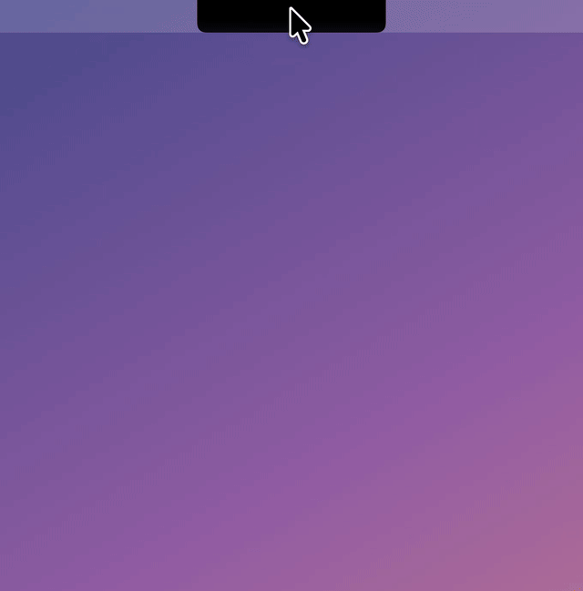
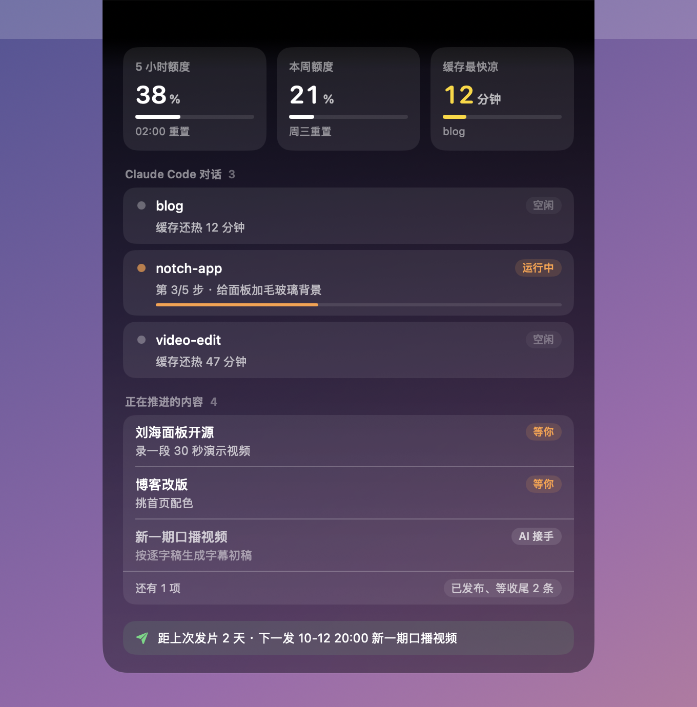

[English](README.md) | **中文文档**

# cyxj-notch（刘海台）

> cyxj-notch 是一个给 Claude Code 用的 macOS 刘海面板：鼠标移到 MacBook 刘海上，就能看到 5 小时额度和本周额度、每个开着的 Claude Code 对话（运行中 / 空闲 / 刚跑完）、任务进度、缓存还热几分钟，以及你的内容待办。数据由仓库里自带的 5 个 Claude Code mod 提供。

[](LICENSE)
[](#环境要求)
[](#claude-code-mod-实战)
[](https://www.youtube.com/@cyxj_ai)

<p align="center"></p>

---

## 它做什么

鼠标不在的时候，面板和硬件刘海一样大，藏在刘海里看不见。鼠标停在刘海上 0.15 秒，它从刘海里长出来，变成一块毛玻璃面板；移开 0.3 秒就收回去。收起时点击会穿透到菜单栏。

<p align="center"></p>

| 区块 | 显示什么 | 数据来自 |
|---|---|---|
| 额度 | 5 小时 / 本周用了多少、什么时候重置 | `quota-status` |
| 缓存最快凉 | 停着的对话里缓存剩得最少的那个，只在有对话停着时出现 | `quota-status` |
| 对话 | 每个开着的 Claude Code：运行中 / 空闲 / 刚跑完，第几步和进度条 | `quota-status` + `task-progress` |
| 版本预览 | `claude -p` 跑出来的预览服务，点端口直接打开 | `version-board` |
| 正在推进的内容 | Markdown 待办里的条目，「等你」排最前，其次「AI 接手」，「等某个时间」最后 | `todo-pane` |
| 发片节奏 | 距上次发片几天、下一次定时发布 | `publish-pulse` |

设计上的几个取舍：
- 收起时就是刘海本身（16 寸 MacBook Pro 上是 220 × 38），不在两边多长"耳朵"，不会像在菜单栏上贴了一张纸。
- 贴着刘海那一截是纯黑，往下渐变成系统毛玻璃，和硬件刘海看不出接缝。
- 展开用带一点回弹的弹簧，内容按区块依次浮现（淡入 + 下落 8 点 + 去模糊）；收起更快、不回弹。出场比进场短。

## 环境要求

- macOS 14 及以上（有刘海的 MacBook 最好；没有刘海的屏幕按主屏顶部正中 200 宽的"假刘海"算）
- Swift 5.9+（装 Xcode 或命令行工具即可）
- 支持 mod 的 Claude Code（在 2.1.295 上开发和测试）

## 快速开始

```sh
git clone https://github.com/chenyuxiaojin/cyxj-notch.git
cd cyxj-notch
./build.sh                      # 编译并打包成 build/刘海台.app
open build/刘海台.app           # 启动（Dock 和菜单栏都不出图标）
pkill -x NotchDesk              # 退出
```

再把 mod 加载进 Claude Code，面板才有数据。在 `~/.claude/settings.json` 的 `env` 里把 mod 文件夹加进 `CLAUDE_CODE_PLUGIN_DIRS`（绝对路径，冒号分隔）：

```json
{
  "env": {
    "CLAUDE_CODE_PLUGIN_DIRS": "/path/to/cyxj-notch/mods/quota-status:/path/to/cyxj-notch/mods/task-progress:/path/to/cyxj-notch/mods/version-board:/path/to/cyxj-notch/mods/todo-pane:/path/to/cyxj-notch/mods/publish-pulse",
    "NOTCH_TODO_LOG": "/path/to/your/todo-log.md",
    "NOTCH_PUBLISH_ROOT": "/path/to/your/publish-folder",
    "NOTCH_TZ_OFFSET_HOURS": "8"
  }
}
```

`quota-status` 和 `task-progress` 不用配置。后面三个变量都是可选的，不设的话「正在推进的内容」和「发片节奏」就不显示。

「等你」默认认的是 `我:`，想换成自己的名字：

```sh
defaults write com.xiaochen.notchdesk ownerName 你的名字
```

## Claude Code mod 实战

**Claude Code mod** 是本地插件，由一组"函数钩子"组成：一个 TypeScript 模块，给 Claude Code 的事件（`session.start`、`turn.complete`、`tool.call`、`ui.render` 等）注册处理函数，再调用引擎接口（`$.ui.status`、`$.ui.toast`、`$.fs.write`、`$.session.usage()`、`$.clock.every`、`$.tool.register` 等）。改了文件会自动重新加载，从 `CLAUDE_CODE_PLUGIN_DIRS` 列出的文件夹加载。

这个仓库演示的是一种做法：**mod 往本地写小 JSON，原生 App 去读。** Claude Code 始终是数据源头，刘海台只读不写，也不直接跟 Claude Code 通信。

```
Claude Code 对话 ──(mod 钩子)──► ~/.claude/notch/*.json ──(每 2 秒读一次)──► 刘海台
```

| mod | 在 Claude Code 里做什么 | 给刘海台写什么 |
|---|---|---|
| [`quota-status`](mods/quota-status) | 状态栏常驻额度：5 小时 / 本周用量、周几重置、本对话折合金额、缓存倒计时；额度过 90%、缓存剩 5 分钟时弹提醒 | `sessions/<对话id>.quota.json`，60 秒一次，对话关掉时标 `ended` |
| [`task-progress`](mods/task-progress) | 给 Claude 注册一个「报进度」工具，3 步以上的活每完成一步走一格，输入框上方显示进度条 | `sessions/<对话id>.progress.json`，进度变化时 |
| [`version-board`](mods/version-board) | `/banben` 侧边面板：`claude -p` 开的预览服务、档位、跑完没；一次超过 3 个就拦下 | `versions.json`，8 秒一次 |
| [`todo-pane`](mods/todo-pane) | `/daiban` 侧边面板：Markdown 待办里的「当前在忙」和「已发布待收尾」 | `todo.json`，5 分钟一次 + 每轮结束 |
| [`publish-pulse`](mods/publish-pulse) | 状态栏常驻发片节奏：距上次发片几天（红黄绿灯）+ 下一次定时发布 | `pulse.json`，10 分钟一次 + 每轮结束 |

每个 mod 的可配置项集中写在 `hooks/register.ts(x)` 顶部，都有自己的测试：

```sh
cd mods/quota-status
claude plugin validate .   # 结构检查
claude plugin test .       # 跑测试
```

做这几个 mod 的经验：
- **mod 越小越好，文件格式越无聊越好。** 一个文件一个 JSON，带 `at` 时间戳；刘海台 150 秒没收到更新就当对话关了，崩溃了也能自己清掉。
- **写文件，别开服务。** 比起开一个本地服务，写文件不用保活、不用管安全，SwiftUI、菜单栏脚本、网页谁都能读。
- **纯逻辑单独放。** `quota.ts`、`bar.ts`、`scan.ts`、`parse.ts`、`pulse.ts` 里不调引擎，不开 Claude Code 也能单测。
- **命令名只能用英文字母、数字、`_`、`-`**（`/daiban` 可以，中文名会注册失败）。

## 数据格式

都在 `~/.claude/notch/` 下：

| 文件 | 结构 |
|---|---|
| `sessions/<id>.quota.json` | `{ id, cwd, at, working, cache, limits: [{ kind: "five_hour" \| "seven_day", percentUsed, resetsAt }] }` |
| `sessions/<id>.progress.json` | `{ id, at, progress: { done, total, now } \| null }` |
| `versions.json` | `{ at, rows: [{ label, port, effort, state, isRunning, isVersion }] }` |
| `todo.json` | `{ at, busy: [{ title, next }], wrapUp: [{ title, next }] }` |
| `pulse.json` | `{ at, text }` |

一个对话 150 秒没更新就当它关了；版本数据 30 秒没更新就不显示。

待办 log 是普通 Markdown，两个分区。每条「下一步」开头写清轮到谁：`我:`、`AI:` 或 `等 10-13 14:59:`：

```markdown
## 当前在忙

### 刘海面板开源
- 状态(10-09):截图做好,README 写完初稿。
- 下一步:我:录一段 30 秒演示视频
- 入口:`projects/notch/README.md`

## 已发布待收尾
- 上期视频(10-01):补两个平台的链接。
```

## 调界面

```sh
NOTCH_FEED=<放样例 JSON 的文件夹> NOTCH_OPEN=1 ./build/刘海台.app/Contents/MacOS/NotchDesk
```

`NOTCH_FEED` 换数据来源，`NOTCH_OPEN=1` 启动就展开、不收起，方便截图。

## 常见问题

**怎么在 Mac 上不开终端就看到 Claude Code 额度？**
装上 cyxj-notch 和 `quota-status` mod，鼠标移到刘海上就能看到 5 小时和本周的百分比和重置时间，60 秒刷新一次。

**「缓存还热 12 分钟」是什么意思？**
你一直接着聊，Claude Code 会复用提示缓存。对话停下来以后缓存会过期（mod 的算法：有额度窗口的订阅账号按 1 小时，其余按 5 分钟），过期后下一条消息要把整段上下文重发一遍，更慢也更贵。面板显示最快凉的那个，提醒你先回哪个。

**没有刘海的 Mac 能用吗？**
能。没有刘海的屏幕按主屏顶部正中 200 宽的区域算。

**会把数据发到网上吗？**
不会。App 只读 `~/.claude/notch/` 下的本地文件，mod 只往那里写，没有任何联网请求。

**可以只装其中几个 mod 吗？**
可以。哪个数据文件不存在或过期了，对应区块就自动不显示。

**跟状态栏脚本有什么不一样？**
状态栏只在一个终端里。刘海台同时显示所有开着的对话，跨终端、跨项目，在任何 App 里都能看。

## 关于

作者 [@cyxj_ai](https://www.youtube.com/@cyxj_ai)（陈与小金），非程序员，用 Claude Code 做工具。其他项目：[cyxj-groksearch](https://github.com/chenyuxiaojin/cyxj-groksearch) · [cyxj-hyperframes](https://github.com/chenyuxiaojin/cyxj-hyperframes) · [cyxj-remotion-starter](https://github.com/chenyuxiaojin/cyxj-remotion-starter)

## 许可

[MIT](LICENSE)
